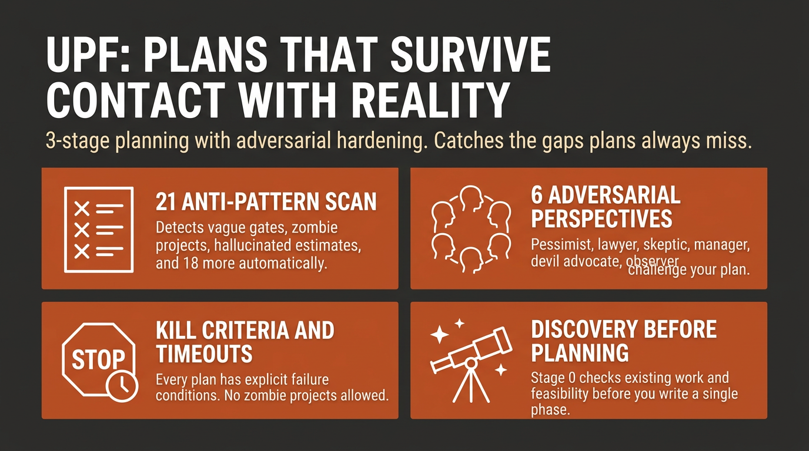

# Universal Planning Framework

[](LICENSE)
[]()
[]()




**Plans fail because discovery happens too late.** This framework catches gaps that only surface during execution - evolved from 117 real plans + 195 handoffs.

> "Initial idea was a custom booking system (8 weeks). Stage 0 discovered Calendly + Stripe does 90% of it. Shipped in 3 weeks, saved 5 weeks of engineering."
> - from [Business Launch Example](examples/business-launch-plan.md)

## Quick Install

**As a plugin** (recommended - nothing is copied into your project):
```bash
/plugin marketplace add primeline-ai/universal-planning-framework
/plugin install universal-planning-framework@primeline-upf
```
Run both inside Claude Code. You get the four commands namespaced, so
`/plan-new` becomes `/universal-planning-framework:plan-new`, plus the `planner`
agent and two skills Claude reaches for on its own, `universal-planning` and
`vehicle-selection`, which carry the rulebook and the vehicle rubric.
Update later with `/plugin marketplace update primeline-upf`.

**Into your project's `.claude/`** (plain files you can read and edit):
```bash
git clone https://github.com/primeline-ai/universal-planning-framework
./universal-planning-framework/setup.sh /path/to/your-project
```
`setup.sh` never replaces a file you already have. If one of its file names clashes
with yours it asks, and skips by default. `--dry-run` shows what it would do,
`--skip-existing` answers every clash without asking, and `--overwrite` replaces
after writing a timestamped backup next to each file. Commands land as `/plan-new`
and friends, with no namespace prefix.

**Minimal** (the rulebook alone, no commands):
```bash
mkdir -p .claude/rules
curl -o .claude/rules/universal-planning.md \
  https://raw.githubusercontent.com/primeline-ai/universal-planning-framework/main/.claude/rules/universal-planning.md
```

## What Makes This Different

Three things carry most of the value.

**Discovery happens before the plan, not during execution.** Stage 0 runs 12 checks
before a single phase is written, and the one that pays for the rest is the AHA check:
*does something that already exists do most of this?* A custom CMS becomes Strapi at
90% of what you needed. Fifty blog posts become five deep ones plus derivatives. The
cheapest moment to find that out is before the plan exists.

**Every plan says when to kill it.** A FAILED condition is mandatory, with a
measurable threshold and a timeout. A plan that only defines success is a plan that
cannot end, which the framework tracks as anti-pattern #11.

**The plan is checked by something other than its author.** `/plan-refine` runs six
adversarial perspectives over it without asking you anything. The Pedantic Lawyer
rejects a gate that says "looks good". The Devil's Advocate attacks the core
assumption. You get back a hardened plan and a log of what changed.

Underneath those:

| | |
|---|---|
| **A reasoning principle, not a checklist** | Built on Decompose-Suspend-Validate. Most plans fail because the wrong question was validated, not because validation was missing. [How it maps to the stages](#theoretical-foundation-dsv) |
| **21 anti-patterns with detection rules** | Not advice. Specific rules that catch vague gates, hallucinated estimates, assumed facts and discovery amnesia. 12 core, 5 AI-specific, 4 quality |
| **Execution vehicle per phase** | The plan decides not only what to do but how each phase runs, from a single agent up to a multi-agent workflow, plus the model tier. Inferred silently, never prompted, so small plans stay frictionless. [Details](#execution-vehicle-selection) |
| **Discipline after the plan, too** | A review after each phase, each phase empirically verified rather than declared done, and anything deferred disclosed with a reason instead of dropped. A Grade B or A plan can ship a [verify report](.claude/templates/verify-report-template.md) proving each gate on three legs: trigger, effect, and whether the consumer can use the result |
| **A rubric that can fail you** | Grade C, B or A on objective criteria. Numbers need sources, gates must be observable, delegated work needs input and output specs |
| **8 domains, detected** | Software, AI/Agent, Business, Content, Infrastructure, Data, Research, Multi-Domain. Each pulls in the sections it needs |
| **Optional behavior specs** | A tech-agnostic Behavior Description and Given/When/Then criteria, for testable coverage without a separate spec document |
| **Reference Library** | Coding plans link the official docs they consulted, so whoever maintains the result has the same sources |

## 5-Minute Quick Start

If you installed the plugin, every command below is namespaced: `/plan-new` becomes `/universal-planning-framework:plan-new`. If you installed into your project's `.claude/`, use the short form as written.

### 1. Create a plan
```bash
/plan-new "Add OAuth login to Next.js app"
```

Claude runs through the framework's stages:
- **Stage 0**: Discovers existing work, checks feasibility, challenges your approach (AHA Effect)
- **Stage 0.5**: Silently picks the execution vehicle + model tier for each phase ([details](#execution-vehicle-selection))
- **Stage 1**: Builds the plan with 5 CORE sections, domain-specific CONDITIONAL sections, and a confidence level
- **Stage 1.5**: Autonomously hardens the plan from 6 adversarial perspectives
- **Stage 2**: Meta-checks including Cold Start Test and Discovery Consolidation

### 2. Interview an existing plan
```bash
/interview-plan path/to/plan.md
```
Framework-aware questions across 3 tiers: critical gaps, domain-specific probes, quality strengthening. Includes [DSV checks](#theoretical-foundation-dsv) for premature commitment and assumption mutation. References anti-patterns by number.

### 3. Review plan quality
```bash
/plan-review path/to/plan.md
```
Objective assessment against the rubric. Returns grade, anti-patterns found, and top 3 improvements.

### 4. Harden a plan autonomously
```bash
/plan-refine path/to/plan.md
```
6 perspectives stress-test the plan. Fixes structural issues, flags strategic decisions for you.

## Theoretical Foundation: DSV

The framework is built on **Decompose-Suspend-Validate** (DSV) - a reasoning principle that prevents premature commitment at every stage of planning.

Most planning failures share a root cause: the planner validates an assumption without first questioning whether it's the right assumption. You check "Can we build X in 4 weeks?" when the real question is "Should we build X at all?" DSV prevents this by structuring thought into three phases:

| Phase | What it does | Framework mapping |
|-------|-------------|-------------------|
| **Decompose** | Break the problem into discrete, testable claims | Stage 0 checks 0.1-0.6 (Existing Work, Facts, Docs, Updates, Practices, Research) |
| **Suspend** | Challenge each claim - explore alternative interpretations before committing | Stage 0 checks 0.7-0.12 (Feasibility, ROI, AHA Effect, Competitive, Constraints, People Risk) |
| **Validate** | Test each claim independently with explicit methods and failure impacts | Stage 1 Assumptions section (`VALIDATE BY` + `IMPACT IF WRONG`) |

The key insight is **Suspend**. Decomposing is natural. Validating is expected. But actively suspending your first interpretation - asking "what if this means something entirely different?" - is what most planners skip. That's why Stage 0's sparring checks (0.7-0.12) exist.

### Quick DSV (3 questions, 30 seconds)

For time-pressured situations, DSV compresses to three questions:

1. **"What are the 2-3 key claims?"** (Decompose)
2. **"What alternative interpretation haven't I considered?"** (Suspend)
3. **"Which claim am I least sure about?"** (Validate that one first)

This works standalone - even without the full framework. Use it before any decision where you catch yourself feeling "obvious."

## The Framework

### Stage 0: Discovery (Before Planning)

12 checks in 3 priority tiers. The agent decides which to run based on context. Maps directly to the [DSV phases above](#theoretical-foundation-dsv): checks 0.1-0.6 decompose, 0.7-0.12 suspend, Stage 1 Assumptions validates.

| Tier | Checks |
|------|--------|
| Always | Existing Work, Feasibility, Better Alternatives (AHA Effect) |
| Usually | Factual Verification, Official Docs, ROI |
| Context-dependent | Updates, Best Practices, Deep Research, Competitive, Constraints, People Risk |

**The AHA Effect** (Check 0.9) is the single most valuable check:
- Custom CMS planned? "Strapi does 90% of it."
- 50 blog posts? "5 pillar posts + derivatives might outperform."
- Building from scratch? "This open-source project does 80%."

### Stage 1: The Plan

**5 CORE sections** (always required): Context & Why (+ optional Behavior Description), Success Criteria (with FAILED conditions + optional GWT acceptance criteria), Assumptions (with VALIDATE BY + IMPACT IF WRONG), Phases (with binary gates + review checkpoints), Verification (Automated + Manual + Ongoing Observability).

**Optional structured formats**: Behavior Description captures what a feature DOES in tech-agnostic language (3-5 sentences). Given/When/Then acceptance criteria complement FAILED conditions - FAILED covers what must NOT happen, GWT covers what MUST happen.

**19 CONDITIONAL sections** (most domain-detected, a few triggered by size, grade or risk instead): Rollback, Risk, Post-Completion, Budget, User Validation, Legal, Security, Resume Protocol, Incremental Delivery, Execution Vehicle & Orchestration, Dependencies, Related Work, Timeline, Stakeholders, Reference Library, Learning & Knowledge Capture, Feedback Architecture, Verify Report, Completion Gate.

**Coding domains** size phases by scope (files, features, tests), not hours. Non-coding domains use time estimates as rough guides.

**Plan Confidence Level**: High / Medium / Low - assigned at plan header. Low confidence = Phase 1 must be a validation sprint.

### Stage 1.5: Autonomous Hardening (Optional)

6 adversarial perspectives stress-test the plan:

1. **Outside Observer** - Goal clarity, End State, ambiguous metrics
2. **Pessimistic Risk Assessor** - Single failure points, FAILED condition timeouts
3. **Pedantic Lawyer** - Vague gates, delegation contracts, deployment completeness
4. **Skeptical Implementer** - First blocker, unverified facts, cold start readiness
5. **The Manager** - Resume Protocol, scope realism, deadline acknowledgment
6. **Devil's Advocate** - Core assumption validity, 80/20 path, obsolescence risk

Structural fixes applied in place. Strategic decisions flagged as `[Stage 1.5 Note:]` for user review. Hardening Log appended as audit trail.

### Stage 2: Meta (7 Checks)

Execution Vehicle Validation, Research Needs, Review Gates, Anti-Pattern Check (21), Cold Start Test, Plan Hygiene Protocol, Discovery Consolidation.

### Execution Vehicle Selection

After discovery, before drafting phases, the framework infers the best **execution vehicle** for each phase and records it as a plan output - collapsing to a single `Default Vehicle` line when the whole plan is uniform, and rendering only the phases that deviate:

| Vehicle | When |
|---------|------|
| **Single agent** | low complexity, one stream of work, or a step the user must see / an irreversible side-effect |
| **Sub-agent(s)** | mid complexity, one to a few independent units (run in parallel when independent) |
| **Agent team** | several interdependent streams that genuinely need inter-agent communication |
| **Background session** | long-running work that needs monitoring |
| **Dynamic workflow** | codebase-wide audit, large migration, or fan-out research that needs adversarial verification |
| **Goal-loop** | work-until-a-condition with an unknown iteration count |

Raw signals (complexity, independent-stream count, whether the work-list is known up front, reversibility) drive the choice; an optional adaptive delegation score only breaks ties at the single-agent/sub-agent boundary, so it can never over-escalate to a heavy vehicle. Selection is **always silent** - there is no interactive vehicle prompt on any plan.

For multi-agent vehicles the plan also names the **model tier per stage**: the strongest model for orchestration/synthesis only, a mid-tier model for delegated work, and a fast or local model for simple or bulk-transform steps. `/plan-review` flags a multi-agent vehicle with no routing plan, or a cheap bulk step routed to an expensive model. Full rubric: [`.claude/rules/vehicle-selection.md`](.claude/rules/vehicle-selection.md).

## Domain Detection

| Domain | Key Sections | Phase Sizing | Review Frequency |
|--------|-------------|-------------|-----------------|
| Software Development | Rollback, Risk, Execution Vehicle & Orchestration, Reference Library | Scope-based | Every 2 phases |
| Multi-Agent / AI | Risk, Execution Vehicle & Orchestration, Security, Reference Library | Scope-based | Every 2 phases |
| Business / Strategy | Timeline, Budget, Stakeholders, Validation | Time-based | Per milestone |
| Content / Marketing | Timeline, Validation, Legal, Feedback Architecture | Time-based | Per draft |
| Infrastructure / DevOps | Rollback, Risk, Dependencies, Reference Library | Mixed | Every phase |
| Data & Analytics | Risk, Rollback, Legal, Security, Reference Library | Mixed | Every phase |
| Research / Exploration | Incremental, Budget, Related Work, Learning | Time-based | Per finding |
| Multi-Domain | Union of matched domains | Most conservative | Most conservative |

## Quality Rubric

| Grade | Criteria |
|-------|----------|
| **C** (Viable) | All 5 CORE + 1 CONDITIONAL. No critical anti-patterns (#3, #9, #11, #20, #21). |
| **B** (Solid) | C + Stage 0 + FAILED conditions + Confidence Level + Cold Start Test. Zero anti-patterns. |
| **A** (Excellent) | B + sparring (0.7-0.9) + Review Checkpoints + Reference Library (coding) + Replanning triggers. |
| **Red Flags** | Vague criteria, no FAILED conditions, assumptions untested, numbers without sources, delegated work without specs. Fix before implementing. |

## When to Activate

**Use for:** New features, architecture changes (3+ files), multi-phase projects, anything with external dependencies.

**Skip when ALL true:** Single file, no external dependencies, <50 lines, no schema change, no user-facing change, rollback = git revert.

## Philosophy

```
Traditional   Goal -> Approach -> Steps -> Execute -> "we did not consider X"
This          Discovery -> Constraints -> Assumptions -> THEN plan
```

Stage 0 is where you find out that the "simple feature" touches six systems, that the
existing code already does 70% of it, that the timeline was off by 3x, and that there
is a legal requirement nobody mentioned.

The [DSV principle](#theoretical-foundation-dsv) explains why that works. Most
"overlooked" requirements were never missing from the problem. They were missing from
the planner's reading of it, and no amount of validating the wrong question recovers
them.

Nothing here is specific to code. Software features, business launches, content,
data pipelines, research: if it needs a plan, it fits.

## Examples

| Example | Domain | Grade | Key Features |
|---------|--------|-------|-------------|
| [Business Launch](examples/business-launch-plan.md) | Business / Strategy | A | AHA Effect saved 6 weeks, 8 sub-phases, full CONDITIONAL suite |
| [Content Creation](examples/content-creation-plan.md) | Content / Marketing | B | 11 sub-phases, code examples, Resume Protocol |
| [Software Feature](examples/software-feature-plan.md) | Software Development | B | OAuth implementation, Security section, Reference Library |
| [Infrastructure CI/CD](examples/infra-cicd-plan.md) | Infrastructure / DevOps | A | Resume Protocol, Rollback, Reference Library, Review Checkpoints |

## Contributing

See [CONTRIBUTING.md](CONTRIBUTING.md) for guidelines. Key requirements:
- Example plans must pass their own anti-pattern self-audit honestly
- Use grades C/B/A only (no B+, A-, etc.)
- Coding examples must include a Reference Library

Found a gap the framework doesn't catch? [Open an issue](https://github.com/primeline-ai/universal-planning-framework/issues).

## The Ecosystem

UPF is one piece of a progression. Each tier works on its own, with no hard dependencies between them.

```
You're here          You want this               Install this
-----------          -------------               ------------
Raw Claude Code  ->  Session memory          ->  Starter System (free)
                 ->  Workflow skills         ->  + Skills Bundle (free)
                 ->  Deep planning           ->  + UPF (free) <- you are here
                 ->  Deep analysis           ->  + Quantum Lens (free)
                 ->  A self-improving setup  ->  + Evolving Lite (free)
```

| Component | What it does | Links |
|-----------|--------------|-------|
| **Starter System** | Session memory, handoffs, context awareness | [GitHub](https://github.com/primeline-ai/claude-code-starter-system) · [Blog](https://primeline.cc/blog/session-management) |
| **Skills Bundle** | 5 workflow skills: debugging, delegation, planning, code review, config architecture | [GitHub](https://github.com/primeline-ai/primeline-skills) · [Blog](https://primeline.cc/blog/score-based-auto-delegation) |
| **UPF** | This repo. Discovery-first planning with adversarial hardening | [Blog](https://primeline.cc/blog/planning-framework-dsv-reasoning) |
| **Quantum Lens** | Multi-perspective analysis and solution engineering, 7 cognitive lenses | [GitHub](https://github.com/primeline-ai/quantum-lens) · [Blog](https://primeline.cc/blog/quantum-lens-multi-agent-analysis) |
| **Evolving Lite** | Self-improving Claude Code plugin: memory, delegation, self-correction | [GitHub](https://github.com/primeline-ai/evolving-lite) · [Blog](https://primeline.cc/blog/knowledge-architecture) |
| **Kairn** | Persistent knowledge graph with context routing | [GitHub](https://github.com/primeline-ai/kairn) · [Blog](https://primeline.cc/blog/knowledge-architecture) |
| **tmux Orchestration** | Parallel Claude Code sessions with heartbeat monitoring | [GitHub](https://github.com/primeline-ai/claude-tmux-orchestration) · [Blog](https://primeline.cc/blog/tmux-orchestration) |

The Skills Bundle includes a lightweight `plan-and-execute` skill for everyday planning. UPF is the deep version, for when the stakes justify Stage 0 discovery.

## License

MIT. See [LICENSE](LICENSE).
